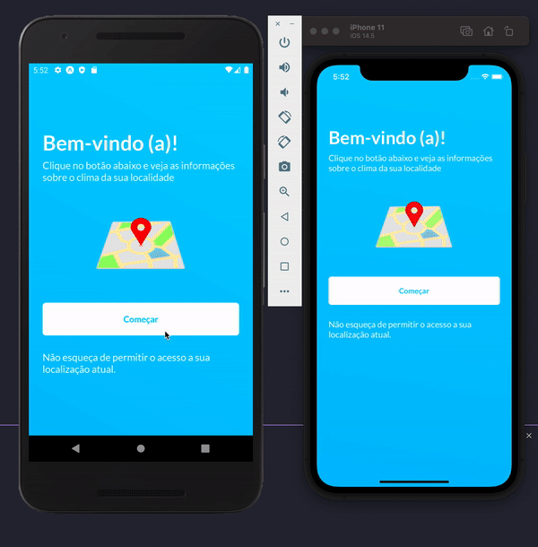
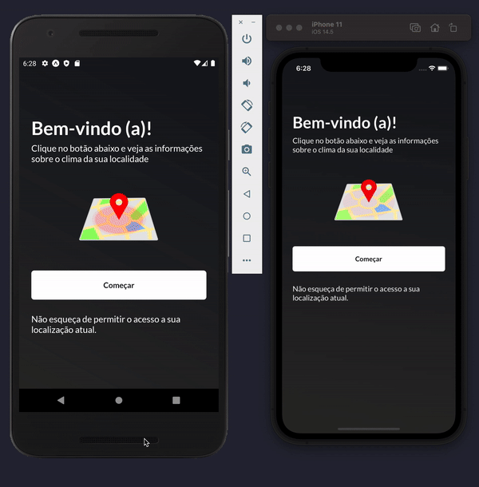

# ⚡ Teste técnico Builders - Weather App ⚡

<h1 align="center">
  
</h1>

# Definição:
- Desenvolver um aplicativo que consuma a localização do usuário e exiba na interface o endereço atual os dados climáticos da região e um botão para atualizar os dados.

# Resultado:

### Dia

### Noite

# Tecnologias utilizadas:
- Expo BareWorkflow
- Expo Location
- Typescript
- Axios
- Styled-Components
- Testing Library e Jest
- Lottie

# Como executar:
 - Clone o projeto na sua máquina

- Projeto construído com BareWorkflow permite que o projeto seja executa com o Expo e com o React Native CLI
### Para executar com o Expo:
- Instale a CLI do Expo no seu computador
- Rode o comando yarn ou npm install
- Rode o comando expo start
- No navegador, escolha qual o simulador/emulador vai utilizar e clique em Run
### Para executar com a CLI
- Caso esteja em um mac, digite cd ios/ && pod install
- Na raiz do projeto rode o comando yarn start
- Após o carregamento do Metro, abra outra aba do terminal e rode yarn ios ou yarn android

### Executar os testes:
- Os testes estão no diretório tests dentro da pasta src
- Rode yarn test no terminal para executar os testes da aplicação

# Melhorias: 
- Melhorar responsividade em dispositivos menores
- Biblioteca de localização apresenta problema em alguns dispostivos antigos
# Documentação:
[Notion](https://huduarte.notion.site/Documenta-o-Weather-App-09f718744b5b4c2ca84b9bd2376e9754)

[Miro](https://miro.com/app/board/uXjVOXYU494=/?invite_link_id=428405777591)